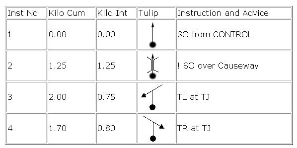

# Tulip Composer 2

Tulip Composer is a free online software for generating roadbook Tulips.

## Online version

The official webpage with a working online version is https://www.danbp.org/tulipcomposer/

## Tulips (not the flower)

A tulip is a pictorial representation of the route. Each junction along the route is drawn as a small diagram which shows the design of the junction, and the route to follow at that point. In their most straightforward form, the tulip will show the exact arrangements of roads at the junction, oriented with respect to the car or else to the map. A large dot shows which branch you enter along, and an arrow shows which branch to leave along ("dots and arrows"). Such tulips are incredibly easy to use, and if given the route in this form, you may not need to draw the route on the map at all.

Tulips are also used in road books on other types of motorsports events, such as stage rallies, classic runs, treasure hunts and so on. You are bound to come across them sooner or later.

 <small>Turn right after
the bridge</small>

## Roadbook

Roadbook is a set of instructions for navigation that eliminates the need for a map. Something like this:

Use Excel, Word or Libre Office to generate the tables, create the tulips using Tulip Composer and you are set. If someone want to donate a roadbook template for this site I will be grateful.
SVG Image Format

This is an open standard for vector graphics and the default output format for Tulip Composer. Vector graphics can be resized without losing quality.
The images can be displayed in any browser, can be edited using the free [Inkscape](https://www.inkscape.org) software or from the Notepad and can be imported into any Microsoft Office application.

## Old Tulip Composer

Check the [2006 Java Based Tulip Composer](https://www.danbp.org/tulipcomposer/tulipcomposerclassic.html).

## License

Tulip Composer is distributed for free under the GNU/GPL License Version 3. The generated tulips are licensed under the Creative Commons Attribution 4.0 International License and you can use them for free for any purpose.

## Credits

Tulip Composer was created in 2005 and then rewritten in 2019 by [Daniel Brooke Peig](https:/www.danbp.org).

## Third party components

Tulip Composer would not exist without the components written by:

- [Bootstrap](https://getbootstrap.com/)
- [Bootswatch from Thomas Park](https://bootswatch.com/)
- [IcoMoon](https://icomoon.io/)
- [FontAwesome](https://fontawesome.com/)
- [Pickr from Simon Wep](https://simonwep.github.io/pickr/)